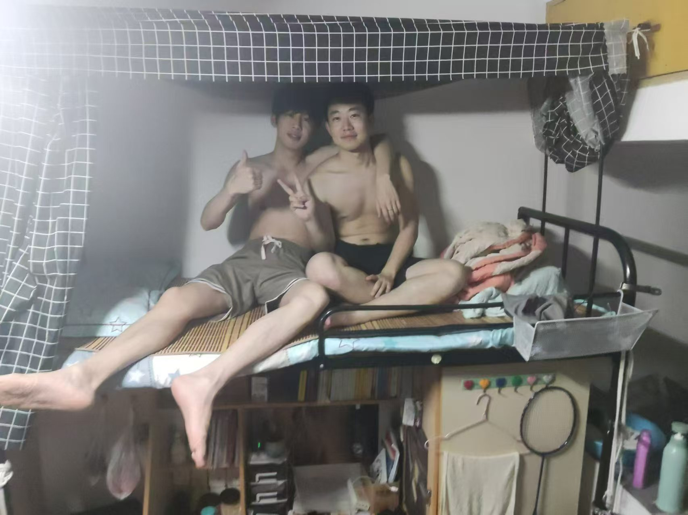

<!-- # 我的生活照

## 照片分类

### 旅行
### 家庭聚会
### 日常生活
### 特殊时刻 -->

---

<!-- ## 旅行 -->

<!--  -->
**描述**: 限时活动，敬请期待。

<!-- 
**描述**: 在日本京都的金阁寺前拍照。2022年春天，我和家人一起去了日本，体验了传统的茶道和文化。 -->

---

<!-- ## 家庭聚会

**描述**: 2023年春节，全家人团聚在一起吃年夜饭。这张照片记录了我们全家人的幸福时光。

**描述**: 2022年国庆节，我们全家一起去海边度假。这张照片是在海边拍摄的，大家都笑得很开心。

---

## 日常生活

**描述**: 每天早晨，我都会去公园晨跑。这张照片是在公园里拍摄的，阳光正好，心情也很愉快。

**描述**: 周末的时候，我喜欢在家里做一顿丰盛的午餐。这张照片是我做的意面，味道很不错。

---

## 特殊时刻

**描述**: 2023年6月，我参加了公司的年会。这张照片是在年会上拍摄的，我获得了最佳员工奖。

**描述**: 2022年12月，我参加了马拉松比赛。这张照片是在终点线前拍摄的，虽然很累，但成就感满满。

---

## 更多照片

### 旅行
- 
- 

### 家庭聚会
- 
- 

### 日常生活
- 
- 

### 特殊时刻
- 
- 

---

## 关于我

你好！我是 [你的名字]，喜欢摄影和旅行。欢迎关注我的博客，查看更多精彩内容。

---

## 联系方式

- **邮箱**: [你的邮箱]
- **社交媒体**: 
  - [Twitter](https://twitter.com/yourusername)
  - [Instagram](https://instagram.com/yourusername)
  - [Facebook](https://facebook.com/yourusername)

---

## 版权声明

所有照片均为本人原创，未经授权请勿转载。

---

希望这个模板能帮助你更好地展示和管理你的生活照片！如果有任何问题或需要进一步的帮助，请随时联系我。 -->