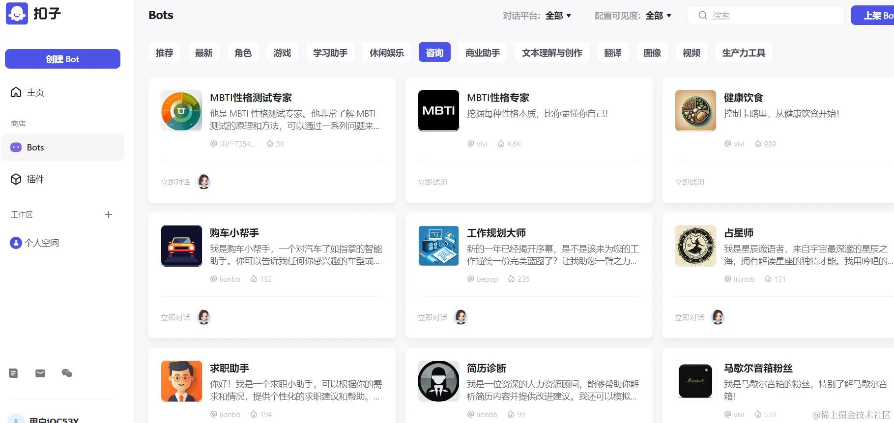

## 前言
如今AI风靡全球，**LLM**，**文心一言**、**Qwen**、**云雀语言大模型**等各种大模型现世，这给我们的生产生活带来了极大的便利，对于我们程序员来说，也极大地便利了我们的项目开发。在这一波波浪潮下，2024年2月字节旗下的一款AI Bot 开发平台 - coze也在国内上线了。

## 是什么

*扣子是新一代一站式 AI Bot 开发平台。无论你是否有编程基础，都可以在扣子平台上快速搭建基于 AI 模型的各类问答 Bot，从解决简单的问答到处理复杂逻辑的对话。而且你可以将搭建的 Bot 发布到各类社交平台和通讯软件上，让更多的用户与你搭建的 Bot 聊天。*

也就是说，我们可以通过这个平台来搭建一个基于 AI 模型的我们指定功能的聊天机器人。

## 优势
2.  灵活定制：扣子平台支持自定义插件和工作流设计，**无论是否有编程基础**，用户都可以快速搭建自己的机器人，并根据需求灵活定制其功能和逻辑。
3.  用户体验：扣子平台帮助用户构建智能聊天机器人，提供更好的用户体验和服务，满足用户**个性化**的需求。

## 怎么使用

### 1.输入网址coze.cn进入扣子官网，点击开始使用，登录进入主页

### 2.我们可以自己搭建属于我们自己的 AI bot ，也可以使用官方预置的bot

#### 官方预置的bots

我们可以体验官方预置的bot， 如使用购车小帮手来给我们购车提供建议等...
#### 我们也可以搭建一个属于我们自己的AI bot

**一、在主页通过聊天快速搭建**

**二、自己手动创建**

给自己的bot取个名字，并描述一下其功能，图标可以自己设置也可以让其随机生成，它会通过你的功能描述随机生成相应图标。

搭建一个AI bot有三部分内容

- 编写bot的人设与回复逻辑

按照如上格式来编写bot的人设与回复逻辑

- 完善bot的技能

可以添加插件、文件流、知识库等，如添加bot需要的功能插件，插件可以自己编写，也可以使用预置的插件：

- 预览和调试

这样就基本搭建完成了一个简单的AI bot。

### 3.我们还可以发布我们搭建好的bot给别人使用

在这里完成相关的授权和配置就可以发布啦！

bot ID:7340472707563356186