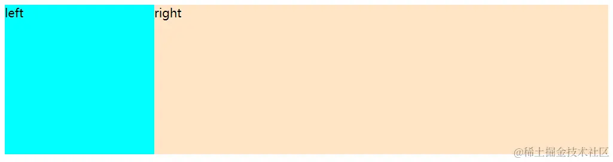
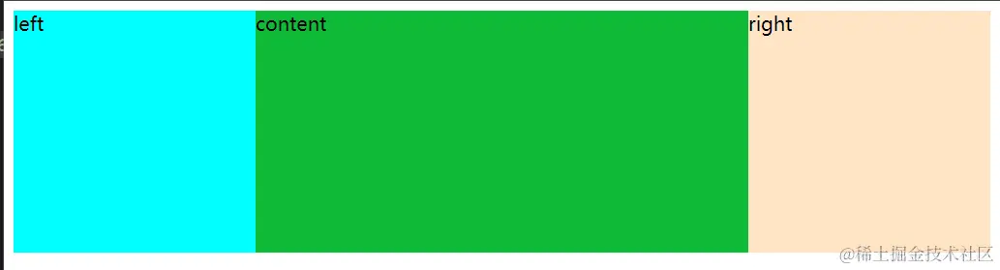

今天讲一讲css中常考的两栏布局和三栏布局。

## 两栏布局

### 是什么

两栏布局是一种常见的网页布局，用于将页面内容分成左右两个部分

### 实现方式
看下面代码，如果我们要实现左边内容固定200px，右边占据剩下的空间。应该怎么做呢？
```html
<div class="wrap">
    <div class="left">left</div>
    <div class="right">right</div> 
 </div>
```

**flex**

```css
<style>
    .wrap{
      height: 200px;
      display: flex;
    }
    .left{
      height: 100%;
      background-color: aqua;
      flex-basis: 200px;
    }
    .right{
      height: 100%;
      background-color: bisque;
      flex: 1;
    }
  </style>
```
**grid**

```css
<style>
    .wrap{
      height: 200px;
      display: grid;
      grid-template-columns: 200px 1fr;
    }
    .left{
      height: 100%;
      background-color: aqua;
    }
    .right{
      height: 100%;
      background-color: bisque;
    }
  </style>
```
**float + BFC || margin-left**

```css
<style>
    .wrap{
      height: 200px;
    }
    .left{
      height: 100%;
      width: 200px;
      background-color: aqua;
      float: left;
    }
    .right{
      height: 100%;
      background-color: bisque;
      overflow: auto; // margin-left: 200px;
    }
  </style>
```
效果图：





## 三栏布局

### 是什么
和两栏布局一样，是一种常见的网页布局，只是将页面内容分成了左中右三部分。

### 实现方式

1. flex
2. grid
3. 左右先加载中间后加载：float
4. 圣杯布局：float + margin负值 + position:relative（中间内容先加载）
5. 双飞翼布局：float + margin负值（中间内容先加载）

前三种就过多赘述了，和两栏布局一样的，这里重点讲一下圣杯布局和双飞翼布局。

圣杯布局

```html + css
<style>
    .wrap{
      height: 200px;
      margin: 0 200px; // 左右两边留下边距用于放左右的内容
    }
    .left{
      height: 100%;
      width: 200px;
      background-color: aqua;
      float: left;
      position: relative;
      right: 200px;
      margin-left: -100%;
    }
    .right{
      height: 100%;
      width: 200px;
      background-color: bisque;
      float: right;
      position: relative;
      left: 200px;
      margin-left: -100%;
    }
    .content{
      height: 100%;
      width: 100%;
      background-color: rgb(15, 186, 55);
      float: left;
    }
    
  </style>
</head>
<body>
  <div class="wrap">
    <div class="content">content</div>
    <div class="left">left</div>
    <div class="right">right</div> 
  </div>
</body>
```

双飞翼布局


```html + css
<style>
    .wrap{
      height: 200px;
    }
    .left{
      height: 100%;
      width: 200px;
      background-color: aqua;
      float: left;
      margin-left: -100%;
    }
    .right{
      height: 100%;
      width: 200px;
      background-color: bisque;
      float: right;
      margin-left: -100%;
    }
    .container{
      height: 100%;
      width: 100%;
      background-color: rgb(15, 186, 55);
      padding: 0 200px;
      box-sizing: border-box;
      float: left;
    }
    
  </style>
</head>
<body>
  <div class="wrap">
    <div class="container">
      <div class="content">content</div>
    </div>
    <div class="left">left</div>
    <div class="right">right</div> 
  </div>
</body>
```
效果图



**假如您也和我一样，在准备春招。欢迎加我微信`shunwuyu`，这里有几十位一心去大厂的友友可以相互鼓励，分享信息，模拟面试，共读源码，齐刷算法，手撕面经。来吧，友友们！**