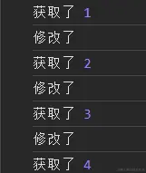
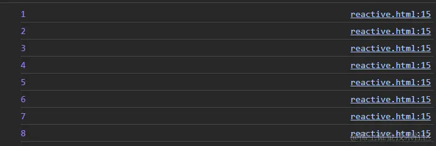

大家好，用了这么久 vue，大家知道 vue 中 reactive 和 ref 的原理和区别吗，我们都知道这是响应式的数据源，那么为什么呢？今天就带大家来深入剖析一下它们的原理。

### 引入

我们先来看看 reactive 的效果：

```vue
import { effect, reactive } from 'vue'; const state = reactive({ count: 1 })
effect(() => { console.log(state.count); // 依次打印1，2，3... }) setInterval(()
=> { state.count++ },1000)
```

`effect`是 vue 中内置的一个方法，类似于`computed`，容易知道，每隔一秒，`state.count`的值就发生变更了，而每次`state.count`值变更都会导致用到该属性的`effect`重新执行一次。

**划重点**

- 当某数据发生变更时，其他用到该属性的地方也会随之产生一些行为，这个数据就被我们称之为响应式数据（如这里的`state.count`）

- 因为某属性发生变更而重新执行的函数就称之为副作用函数（如这里的`effect`）

### 实现一个简单的 reactive

那么怎么实现将一个数据变成响应式呢，从上面我们可以知道，我们只需要将一个对象传入`reactive`中，该对象就变成了响应式，那这...,我又有疑问了，这里可不可以传一个原始类型的数据进去呢？答案是不可以，只能传引用类型。我们先把这个问题搁置在这，等下你就懂了。回到原来的问题，将一个数据变成响应式：

官方是这么干的：

- 抛出一个`reactive`方法
- 将数据传进去

```js
export function reactive(target) {
...... // 具体实现
}
```

那里面又干了些什么操作呢？

1. 首先呢，咱上面也说了，只能传引用类型进去对吧，那我们得先判断传进去的数据是不是引用类型
2. 第二，我们还得判断一下该数据是不是已经是响应式了，如果已经是响应式了，那我们没有必要多此一举是不是
3. 如果数据不是响应式的，对传进来的数据进行“大改造”，变成响应式
4. 将变成响应式的数据存起来，以便第二步的判断。
5. 返回响应式数据

```reactive.js
let proxyMap = new WeakMap() // 用于存放已经代理过的target
// 将数据变成响应式
export function reactive(target) {
    // 判断target是否为引用类型
    if(typeof target !== 'object' || target === null) {
        return target
    }
    // 判断是否已经被代理（是不是响应式）
    const ProxyTarget = proxyMap.get(target)
    if(ProxyTarget) {
        return ProxyTarget
    }
    // 执行代理操作（将数据变成响应式）
    const proxy = new Proxy(target,{
        get: (target,key,receiver) => {
            const res = Reflect.get(target,key,receiver) // 获取值
            console.log('获取了', res);
            return res
        },
        set: (target,key,value,receiver) => {
            Reflect.set(target,key,value,receiver) // 修改值
            console.log('修改了');
            return true
        }
    })

    // 将代理过的target存入proxyMap中
    proxyMap.set(target,proxy)

    return proxy
}
```

咱也不卖关子了，没错，将数据变成响应式的关键就是`Proxy`，了解它的小伙伴就应该知道为什么`reactive`只能接受对象作为参数了，因为`Proxy`只接受对象。`Proxy`接收两个参数，第一个参数是一个对象（Proxy 拦截的对象），这里就是我们传进来的对象，第二个参数还是一个对象，里面存放着一些当拦截对象被进行某些操作时（如读取值、设置值）就会触发的函数。

```test.html
<html>
<script type="module">
import { reactive } from './reactive.js'
const state = reactive({
    count: 1
})
setInterval(() => {
    state.count++
},1000)
</script>
</html>
```


当我们读取值和设置值就触发了里面的`get`和`set`

那么，接下来，我们要干嘛呢？

1. 在读取该响应式数据的时候将用到这个响应式数据的函数给收集起来
2. 在数据发生变更的时候触发该函数

```reactive.js
const trackMap = new Map() // 用于存放具有副作用函数的对象
let EffectFunc = null
export function effect(fn) { // 将副作用函数fn抛出
    EffectFunc = fn
    return EffectFunc()
}
// 收集副作用函数
function track(target, key) {
    let depsMap = trackMap.get(target)
    if(!depsMap) { // 判断该对象之前是否已经收集过副作用函数
        depsMap = new Map() // 用于存放具有副作用函数的key
        trackMap.set(target,depsMap)
    }
    let deps = depsMap.get(key)
    if(!deps) {
        deps = new Set() // 用于存放副作用函数
        depsMap.set(key,deps)
    }
    if(!deps.has(EffectFunc) && EffectFunc) {
        deps.add(EffectFunc) // 收集副作用函数
        EffectFunc = null
    }
}
// 触发副作用函数
function trigger(target, key) {
    const depsMap = trackMap.get(target)
    if(!depsMap) {
        return
    }
    const deps = depsMap.get(key)
    if(!deps) {
        return
    }
    deps.forEach(EffectFn => {
        EffectFn() // 将该key的所有副作用函数触发
    });
}
```

这样就基本完成了一个简单的`reactive`，也可以实现最开始我们使用 vue 中提供的`reactive`那个效果。

以下是完整代码：

**JS 代码**

```reactive.js
let proxyMap = new WeakMap() // 用于存放已经代理过的target
const trackMap = new Map() // 用于存放具有副作用函数的对象
let EffectFunc = null // 临时存放副作用函数
// 将副作用函数抛出
export function effect(fn) { // 将副作用函数fn抛出
    EffectFunc = fn
    return EffectFunc()
}
// 收集副作用函数
function track(target, key) {

    let depsMap = trackMap.get(target)
    if(!depsMap) {
        depsMap = new Map()
        trackMap.set(target,depsMap)
    }
    let deps = depsMap.get(key)
    if(!deps) {
        deps = new Set()
        depsMap.set(key,deps)
    }
    if(!deps.has(EffectFunc) && EffectFunc) {
        deps.add(EffectFunc)
        EffectFunc = null
    }
}

// 触发副作用函数
function trigger(target, key) {
    const depsMap = trackMap.get(target)
    if(!depsMap) {
        return
    }
    const deps = depsMap.get(key)
    if(!deps) {
        return
    }
    deps.forEach(EffectFn => {
        EffectFn()
    });
}

// 将数据变成响应式
export function reactive(target) {
    // 判断target是否为引用类型
    if(typeof target !== 'object' || target === null) {
        return target
    }
    // 判断是否已经被代理
    const ProxyTarget = proxyMap.get(target)
    if(ProxyTarget) {
        return ProxyTarget
    }
    // 执行代理操作
    const proxy = new Proxy(target,{
        get: (target,key,receiver) => {
            const res = Reflect.get(target,key,receiver) // 获取值
            // 收集副作用函数（即用到了这个属性的函数）
            track(target,key)
            return res
        },
        set: (target,key,value,receiver) => {
            Reflect.set(target,key,value,receiver) // 修改值
            // 值变更时触发副作用函数
            trigger(target,key)
            return true
        }
    })

    // 将代理过的target存入proxyMap中
    proxyMap.set(target,proxy)

    return proxy
}
```

**HTML 代码**

```test.html
<html>
<script type="module">
import { reactive, effect } from './reactive.js'
const state = reactive({
    count: 1
})
effect(() => {
  console.log(state.count); // 依次打印1，2，3...
})
setInterval(() => {
    state.count++
},1000)
</script>
</html>
```

**效果图**



### 总结一下：

reactive 只能将引用类型代理成响应式，是因为 Proxy 只接受引用类型

被代理对象中的任意属性发生修改，都应该将用到了这个属性的各个函数（副作用函数）重新执行一遍，那么在此执行之前，就需要先为每一个属性都做好副作用函数的收集（依赖收集）

1. 用 Proxy 代理了对象
2. 在代理函数 get 中 对使用了的属性做 副作用函数收集
3. 在代理函数 set 中 对修改了的属性做 副作用函数的触发

未完待续......

**假如您也和我一样，在准备春招。欢迎加我微信`shunwuyu`，这里有几十位一心去大厂的友友可以相互鼓励，分享信息，模拟面试，共读源码，齐刷算法，手撕面经。来吧，友友们！**
